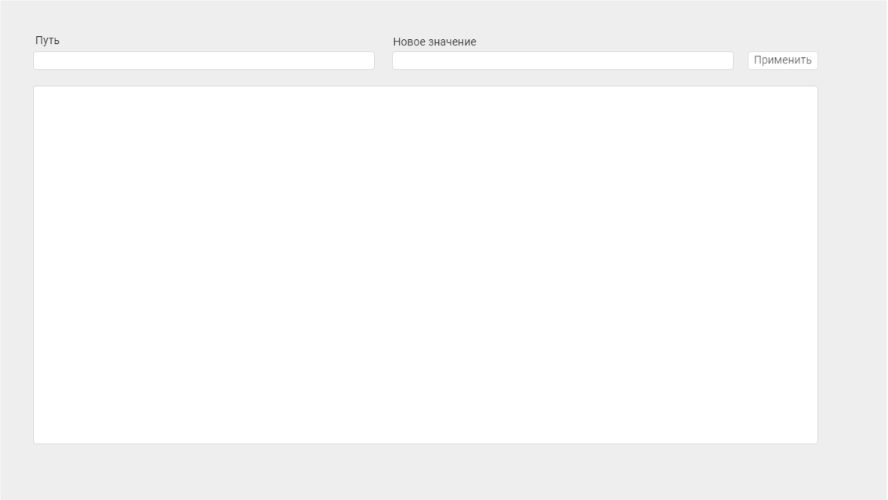

Для запуска приложения потребуется [Node.js c npm](https://nodejs.org) версии не ниже 16.15.0

После установки и клонирования репозитория, выполните в терминале команды
```
npm i
npm start
```

# Задание
Используя React + Redux, создайте компонент, в котором будут два поля для ввода, кнопка и область для отображения контента:

Область «контент» задается объектом content, который может включать в себя несколько типов элементов:

1. panel со свойствами: width, height, visible
2. label со свойствами: caption, visible
3. button со свойствами: caption, width, height, visible

width, height – число
caption – текст
visible – true/false

пример:
```
content = [
	{
		type: 'panel',
		props: {
			width: 500,
			height: 200,
			visible: true
		},
	},
	{
		type: 'label',
		props: {
			caption: 'test',
			visible: false
		},
	},
	{
		type: 'button',
		props: {
			width: 100,
			height: 50
			visible: true
		},
	}
]
```

Элемент 'panel' может включать в себя любые другие элементы в том числе другие 'panel'. Например:
```
{
	type: 'panel',
	props: {
		width: 500,
		height: 200,
		visible: true
	},
	content: [{
			type: 'label',
			props: {
				caption: 'test',
				visible: false
			}
	}]
}
```

## Задача:
1. Задать начальный content, который будет включать в себя весь перечень элементов и отобразить его на экране (panel - <div> с рамкой, label - <span> c текстом, button - <button> с надписью) соответственно с учетом размеров и видимости
2. в поле «Путь» вводим строку, в которой задаем путь внутри объекта. Например:
  ```
  'content[2].props.caption'
  ```
  В поле «Новое значение» указываем новое значение данного свойства. Например: 'test2'. По клику на кнопке «применить» объект должен измениться, и на экране должно отобразиться новое содержимое content.

В поле «Новое значение» можно внести в том числе и такое значение: {type: 'label', props: {caption: 'test', visible: false}}, соответственно в content добавится вложенный объект.

Изменение объекта content должно происходить с использованием spread оператора «...», не следует для этой цели использовать сторонние пакеты или клонирование объекта с помощью JSON.parse(JSON.stringify()).
